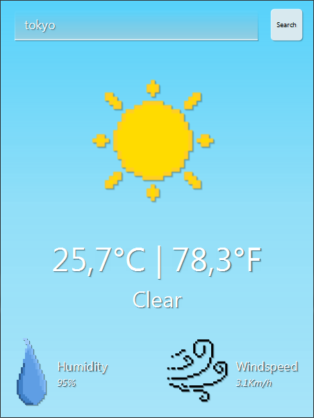

# Weather View FX

Weather View FX is a JavaFX application that allows users to input a location and view current weather details.

## Technologies Used
- JavaFX;
- [API Open Meteo ](https://open-meteo.com/).

## Requirements
- JDK 8 or higher.
